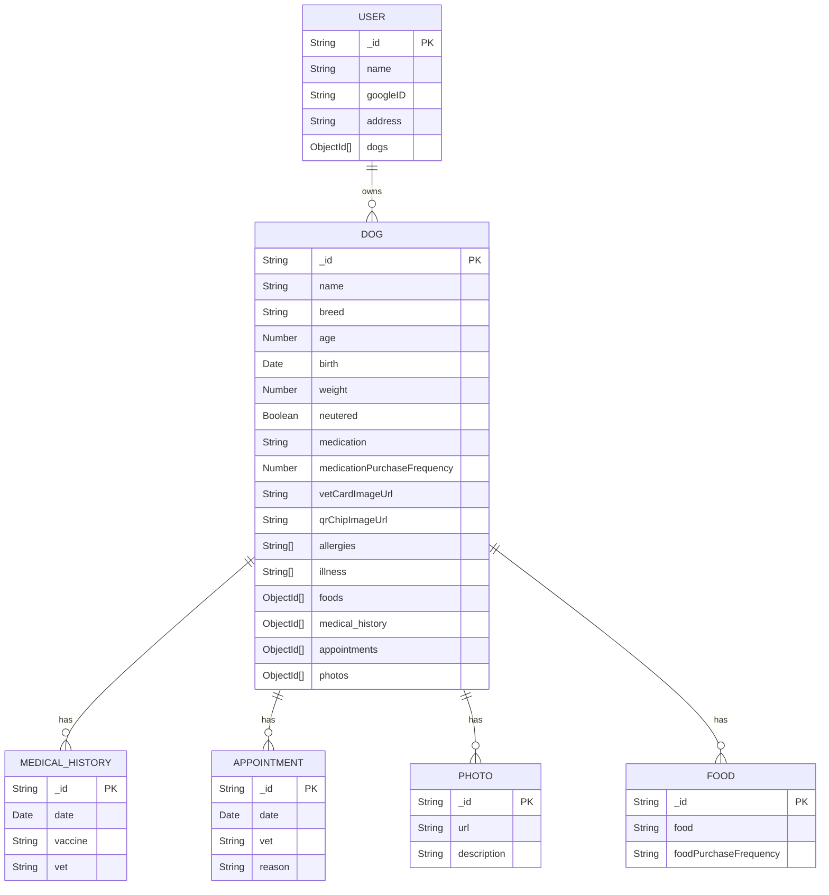

# Database Entity Relationship Diagram

```mermaid
erDiagram
    USER {
        String _id PK
        String name
        String googleID
        String address
        ObjectId[] dogs
    }
    DOG {
        String _id PK
        String name
        String breed
        Number age
        Date birth
        Number weight
        Boolean neutered
        String medication
        Number medicationPurchaseFrequency
        String vetCardImageUrl
        String qrChipImageUrl
        String[] allergies
        String[] illness
        ObjectId[] foods
        ObjectId[] medical_history
        ObjectId[] appointments
        ObjectId[] photos
    }
    
    MEDICAL_HISTORY {
        String _id PK
        Date date
        String vaccine
        String vet
    }
    APPOINTMENT {
        String _id PK
        Date date
        String vet
        String reason
    }
    PHOTO {
        String _id PK
        String url
        String description
    }
    FOOD {
        String _id PK
        String food
        String foodPurchaseFrequency
    }
    USER ||--o{ DOG : owns
    DOG ||--o{ MEDICAL_HISTORY : has
    DOG ||--o{ APPOINTMENT : has
    DOG ||--o{ PHOTO : has
    DOG ||--o{ FOOD : has
```

