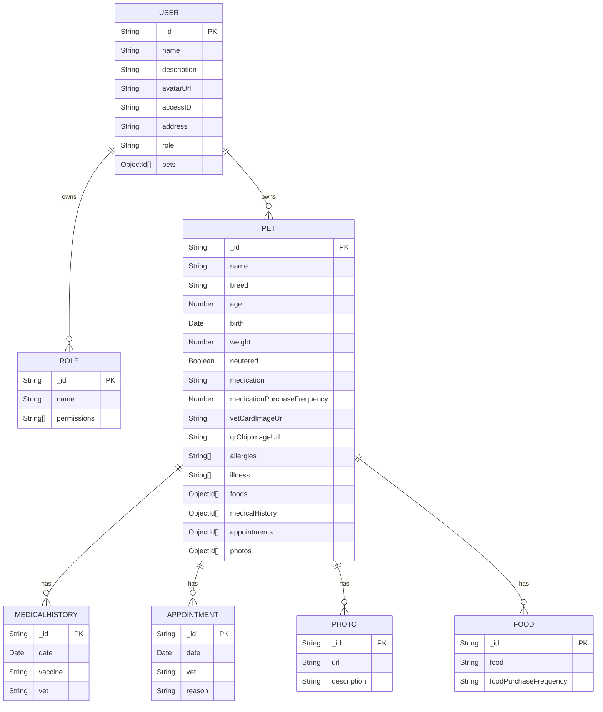

# Database Entity Relationship Diagram

```mermaid
erDiagram
    USER {
        String _id PK
        String name
        String description
        String avatarUrl
        String accessID
        String address
        String role
        ObjectId[] pets
    }
    ROLE {
        String _id PK
        String name
        String[] permissions
    }

    PET {
        String _id PK
        String name
        String breed
        Number age
        Date birth
        Number weight
        Boolean neutered
        String medication
        Number medicationPurchaseFrequency
        String vetCardImageUrl
        String qrChipImageUrl
        String[] allergies
        String[] illness
        ObjectId[] foods
        ObjectId[] medicalHistory
        ObjectId[] appointments
        ObjectId[] photos
    }
    
    MEDICALHISTORY {
        String _id PK
        Date date
        String vaccine
        String vet
    }

    APPOINTMENT {
        String _id PK
        Date date
        String vet
        String reason
    }
    PHOTO {
        String _id PK
        String url
        String description
    }
    FOOD {
        String _id PK
        String food
        String foodPurchaseFrequency
    }
    USER ||--o{ PET : owns
    USER ||--o{ ROLE : owns
    PET ||--o{ MEDICALHISTORY : has
    PET ||--o{ APPOINTMENT : has
    PET ||--o{ PHOTO : has
    PET ||--o{ FOOD : has
```

