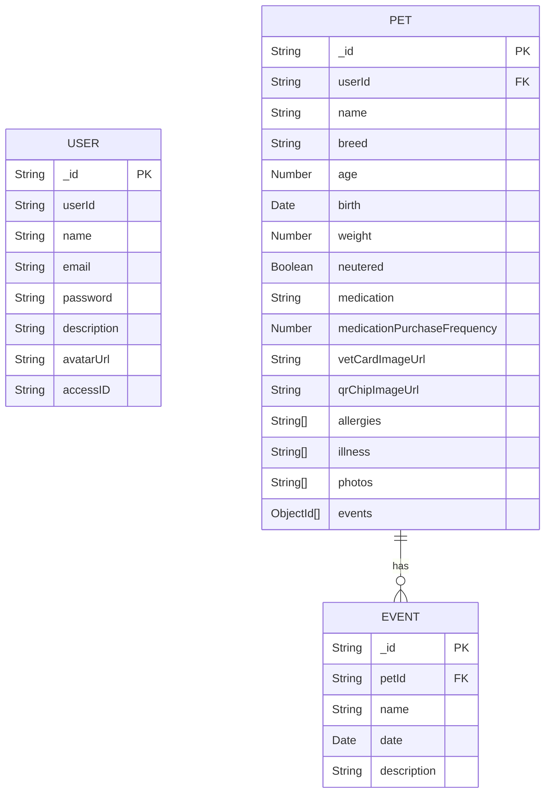

# Database Entity Relationship Diagram

```mermaid
erDiagram
    USER {
        String _id PK
        String userId
        String name
        String email
        String password
        String description
        String avatarUrl
        String accessID
    }


    PET {
        String _id PK
        String userId FK
        String name
        String breed
        Number age
        Date birth
        Number weight
        Boolean neutered
        String medication
        Number medicationPurchaseFrequency
        String vetCardImageUrl
        String qrChipImageUrl
        String[] allergies
        String[] illness
        String[] photos
        ObjectId[] events
    }
    EVENT {
        String _id PK
        String petId FK
        String name
        Date date
        String description
    }

    PET ||--o{ EVENT : has
```

